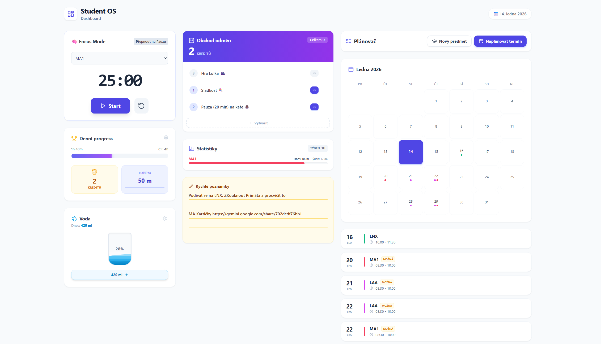
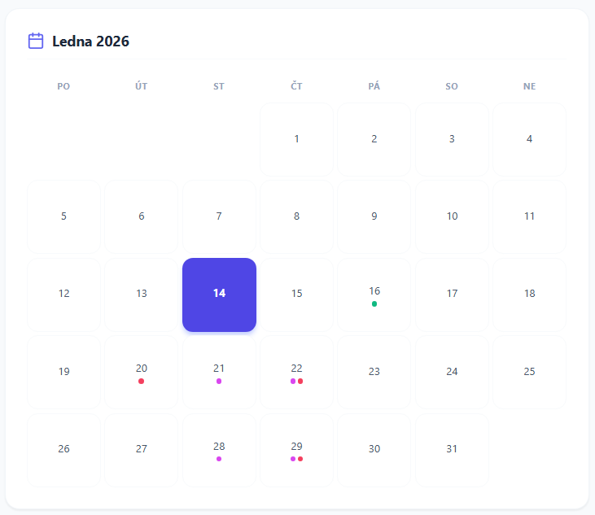
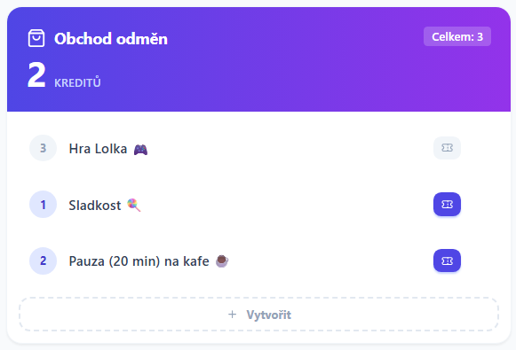
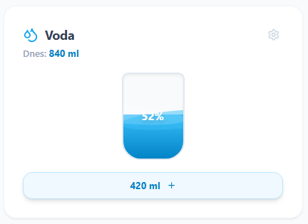
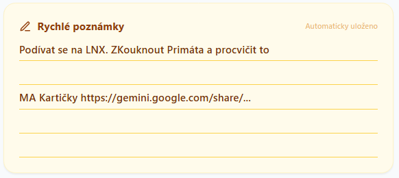

<div align="center">

<h1>🎓 Student OS</h1>

<p>
  <strong>All-in-one dashboard pro efektivní studium, plánování a gamifikaci produktivity.</strong>
</p>



<p>
  <a href="#-rychlý-start"><strong>Rychlý Start</strong></a> ·
  <a href="#-hlavní-funkce"><strong>Funkce</strong></a> ·
  <a href="#-použité-technologie"><strong>Technologie</strong></a>
</p>

</div>

<br>

## 🌟 O projektu

**Student OS** je webová aplikace navržená pro studenty, kteří chtějí mít pořádek ve zkouškách, udržet pozornost a zároveň se u toho bavit.

Místo nudných tabulek využívá **gamifikaci** – za učení získáváš kredity, které můžeš utrácet v obchodě s odměnami.  
Celé to běží v **Dockeru**, takže instalace je otázkou jednoho příkazu a data máš bezpečně u sebe.

---

## ✨ Hlavní Funkce

### 🧠 Produktivita & Focus
- **Focus Timer:** Vestavěný Pomodoro časovač pro hlubokou práci
- **Rychlé poznámky:** Automaticky ukládaný blok pro myšlenky (design linkovaného sešitu)
- **Statistiky:** Přehledné grafy odučeného času (dnes vs. týden)

### 🎮 Gamifikace (RPG prvky)
- **Goal Tracker:** Denní progress bar pro sledování studijních cílů
- **Reward Shop:** Kredity za každých 45 minut učení
- **Vlastní odměny:** Možnost nastavit si vlastní ceník (pivo, seriál, hry…)

### 📅 Plánování & Zdraví
- **Interaktivní Kalendář:** Měsíční pohled s barevným odlišením předmětů
- **Manažer Zkoušek:** Evidence termínů (Zapsáno / Možná) s odpočtem
- **Hydration Tracker:** Interaktivní sklenice s připomínkami pití

---

## 📸 Ukázky aplikace

| Plánovač a Kalendář | Obchod s odměnami |
| :---: | :---: |
|  |  |

| Pitný režim | Poznámky |
| :---: | :---: |
|  |  |

---

## 🚀 Rychlý Start

Nemusíš nic instalovat (Node.js, databázi atd.).  
Stačí mít **Docker Desktop**: https://www.docker.com/products/docker-desktop/

 1️⃣ Stáhni repozitář

```bash
git clone https://github.com/KratosCube/student-os.git
cd student-os
```

### 2️⃣ Spusť aplikaci
```bash
docker-compose up --build
```
První spuštění může chvíli trvat – Docker stahuje závislosti.

### 3️⃣ Hotovo 🎉

Otevři prohlížeč na adrese:  
👉 **http://localhost:3000**

---

## 🛠️ Použité Technologie

- **Frontend:** Next.js 15 (App Router), React
- **Styling:** Tailwind CSS, Lucide Icons
- **Backend / DB:** Prisma ORM + SQLite
- **Infrastruktura:** Docker & Docker Compose

---

<div align="center"> <p>Vytvořeno s ❤️ pro efektivnější studium.</p> </div> 